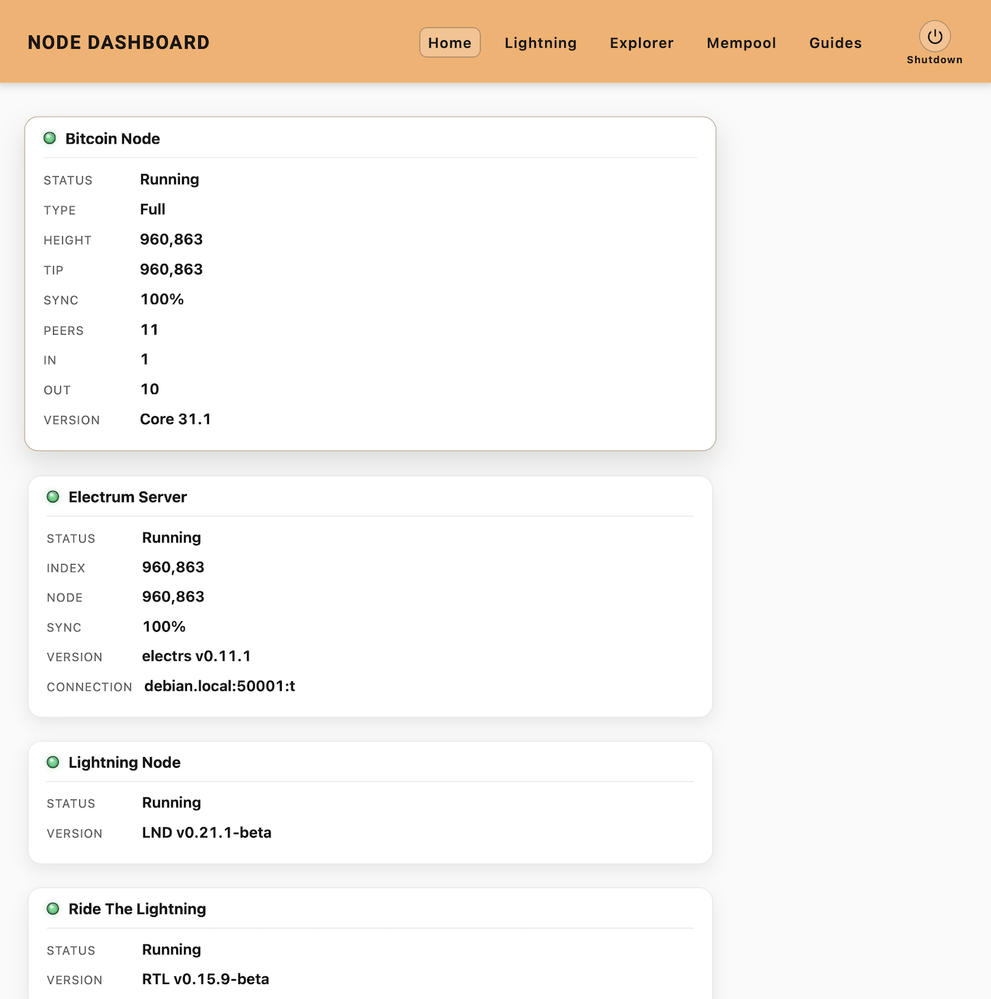
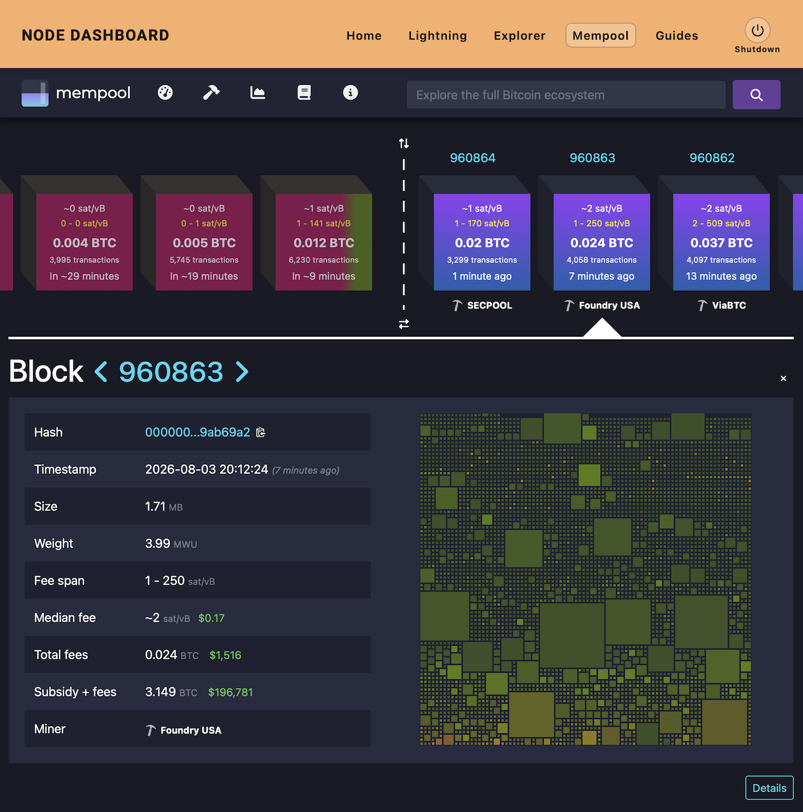

# Dashboard

Dashboard is a lightweight web interface for monitoring a self-hosted Bitcoin and Lightning node.

It provides a simple, dependency-free interface for viewing the status of Bitcoin Core and related services, including Electrs, LND, Mempool, Ride The Lightning (RTL), and BTC RPC Explorer.

Designed for Debian-based systems, Dashboard is intended for trusted, self-hosted environments.

## Features

- Monitor Bitcoin Core, Electrs and LND
- Launch integrated node applications
- View blockchain and Lightning information
- Simple service status indicators
- Safe system shutdown
- Lightweight PHP implementation with no database or framework

## Documentation

Complete installation and configuration instructions are available from the **Bitcoin Node Workshop**:

**https://nelson.au**

The workshop provides a step-by-step guide to building a Debian-based Bitcoin node, including installation and configuration of all supported services.

## License

MIT License

